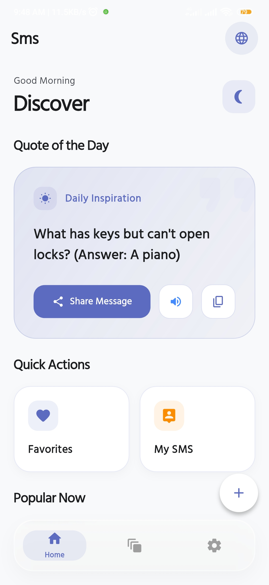
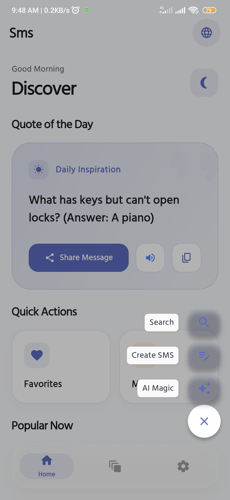
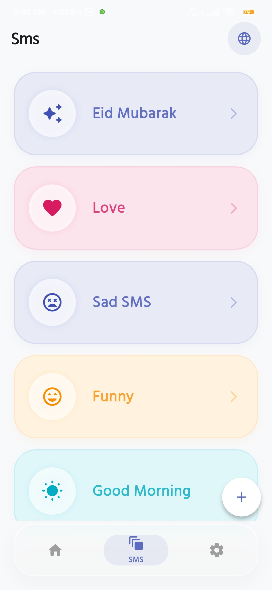
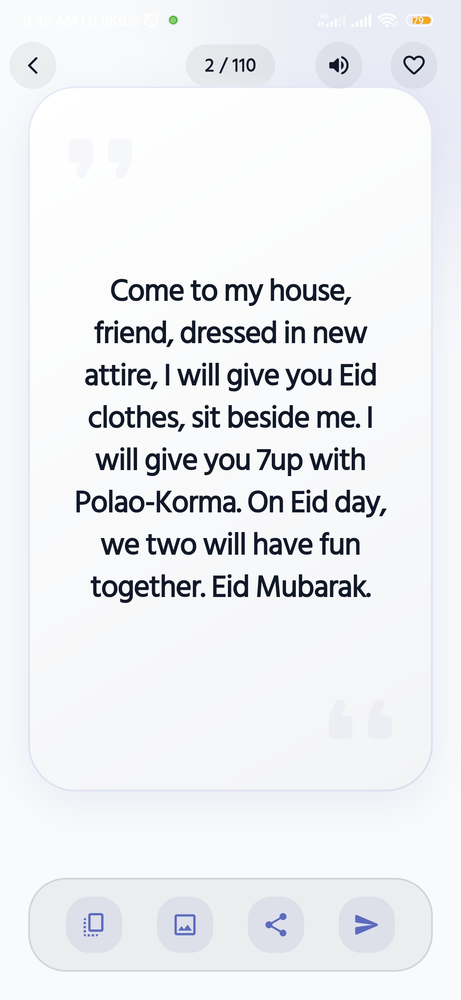
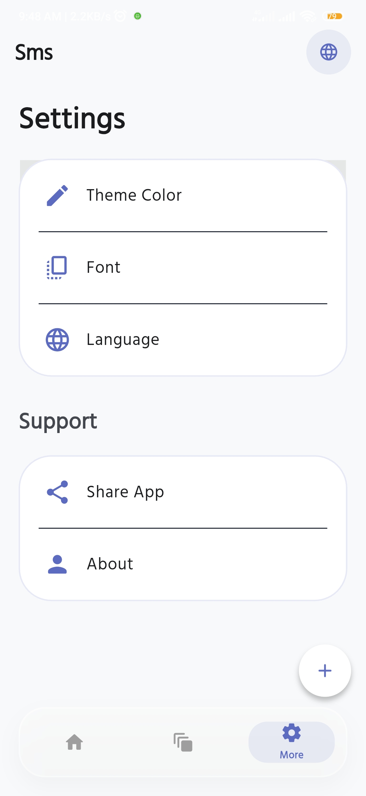
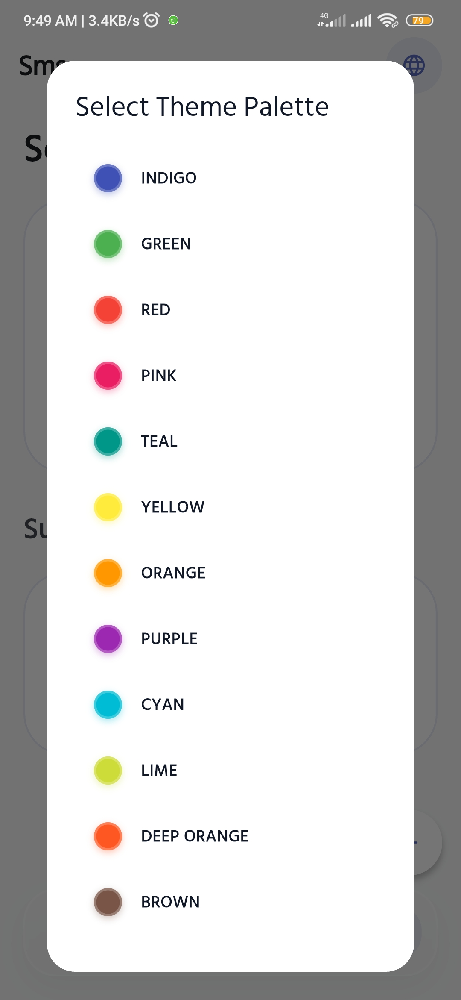
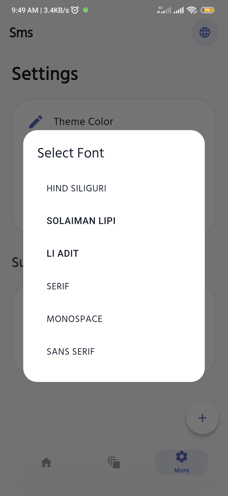
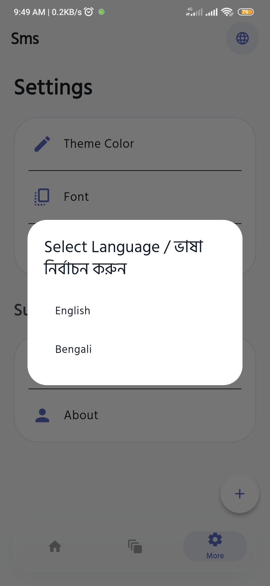

<h1 align="center">📱 SMS App</h1>

<p align="center">
  <strong>A professional, feature-rich, and intelligent SMS management application built with Flutter.</strong>
  <br>
  Fast. Secure. Offline-Ready. AI-Enhanced. Multi-Platform.
</p>

<p align="center">
  
  
  
  
</p>

---

## 📖 Overview

**SMS App** is a next-generation messaging solution designed for efficiency and intelligence. Migrated from a native Android architecture to Flutter, it offers a seamless experience across multiple platforms. It combines modern Material Design, AI-powered tools, and a robust offline-first architecture to provide users with a superior messaging experience.

Whether you're looking for advanced categorization, voice-enabled messaging, or elegant typography support, SMS App is built to deliver.

---

## ✨ Key Features

### 📨 Smart Inbox Management
- **Categorization**: Automatically organizes messages for better discovery.
- **Modern UI**: Smooth animations and a responsive interface using Material Design 3 principles.
- **Interactive Lists**: Features such as slidable actions for quick management.

### 🤖 AI & Intelligent Tools
- **AI-Enhanced Messaging**: Built-in AI tools for smart replies and productivity.
- **Speech-to-Text (STT)**: Dictate your messages effortlessly.
- **Text-to-Speech (TTS)**: Listen to your incoming messages on the go.
- **Smart Search**: Quickly find any message or contact.

### 🎨 Premium User Experience
- **Dynamic Themes**: Support for light, dark, and custom color schemes.
- **Modern Typography**: High-quality font support for a clean and professional look.
- **Lottie Animations**: Engaging and lightweight visual feedback.
- **Speed Dial**: Quick access to common actions like creating new messages.

### 🌐 Localization & Accessibility
- **Full English Support**: Optimized for English-speaking users.
- **Accessibility Optimized**: Built with ease-of-use in mind for all users.

### 🔒 Reliability & Performance
- **Offline-First**: Core functionality works perfectly without an internet connection.
- **Multi-Platform Ready**: Designed to run on Android, iOS, Web, and Desktop.
- **Fast Startup**: Optimized architecture for near-instant launch times.

---

## 📸 Screenshots

<p align="center">
  
  
  
  
</p>

<p align="center">
  
  
  
  
</p>

<p align="center">
  <em>Comprehensive views of the SMS App interface and its AI-driven features.</em>
</p>

---

## 🛠️ Technology Stack

| Category | Technology | Purpose |
|----------|------------|---------|
| **Framework** | [Flutter](https://flutter.dev) | Cross-platform UI development |
| **Language** | [Dart](https://dart.dev) | Application logic |
| **Storage** | `shared_preferences` | Local settings persistence |
| **Animation** | `lottie` | High-quality vector animations |
| **Voice** | `speech_to_text`, `flutter_tts` | Interactive voice features |
| **Media** | `audioplayers` | Audio feedback and playback |
| **Utilities** | `share_plus`, `url_launcher` | Sharing and external links |
| **Typography** | Google Fonts / Custom | Multilingual font support |

---

## 📂 Project Structure

```bash
lib/
├── main.dart           # Application entry point
├── core/               # Global configurations & app-wide logic
│   ├── app_theme.dart  # Theme definitions
│   ├── language.dart   # Localization logic
│   └── app_strings.dart# Centralized string constants
├── data/               # Translation and static data
│   ├── en_data.dart    # English translations
│   └── bn_data.dart    # Bengali translations
├── pages/              # UI screens
│   ├── home_page.dart  # Dashboard
│   ├── sms_list.dart   # Conversation lists
│   └── ai_page.dart    # AI integration screen
├── tools/              # Utility functions
│   ├── sms_utils.dart  # SMS handling logic
│   └── tts_utils.dart  # Voice feature wrappers
└── designs/            # Custom widgets and UI components
    └── ai.dart         # AI-specific UI elements
```

---

## 🚀 Getting Started

### Prerequisites
- [Flutter SDK](https://docs.flutter.dev/get-started/install) (>= 3.0.0)
- [Dart SDK](https://dart.dev/get-started)
- Android Studio / VS Code with Flutter extension

### Installation
1. **Clone the repository:**
   ```bash
   git clone https://github.com/your-username/Sms.git
   cd Sms
   ```

2. **Install dependencies:**
   ```bash
   flutter pub get
   ```

3. **Run the app:**
   ```bash
   flutter run
   ```

---

## 🗺️ Roadmap
- [ ] **Cloud Sync**: Securely backup messages to the cloud.
- [ ] **Spam Detection**: AI-driven filter for unwanted messages.
- [ ] **Scheduled Messaging**: Send messages at a specific time.
- [ ] **Encryption**: End-to-end encryption for private conversations.

---

## 📄 License

Distributed under the MIT License. See `LICENSE` for more information.

<p align="center">
  Developed with ❤️ by <b>Team Softece</b><br>
  <i>Sms</i>
</p>
